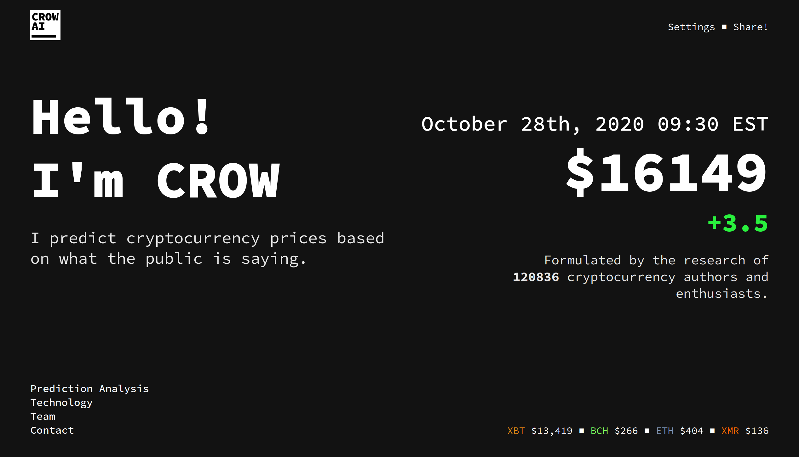

# CROW AI

 

An application that predicts the future price of cryptocurrencies by scraping and analyzing articles written by cryptocurrency analysts and enthusiasts using natural language processing (NLP) and other machine learning algorithms.

## Documentation & API

See [the docs](https://crow-ai.readthedocs.io/en/latest/) for detailed documentation.

See [FAQ](https://crow-ai.readthedocs.io/en/latest/faq.html) for FAQs.

Other resources:

- [Adding support for a site](https://crow-ai.readthedocs.io/en/latest/)
- [Accessing the API](https://crow-ai.readthedocs.io/en/latest/)

## Sites

| name | articles | accuracy | date added |
|------|----------|----------|------------|
| [Coindesk](https://coindesk.com) | 0 | 1 | 10/29/20

## Live Site

Coming soon